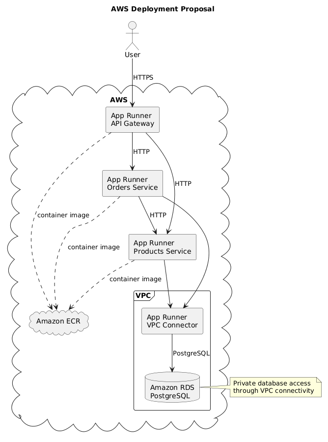

# AWS Deployment

## Proposed architecture

- `api-gateway`, `products-service`, and `orders-service` are deployed as independent containers on AWS App Runner.
- PostgreSQL runs on Amazon RDS.
- Service-to-service communication happens over HTTP using URLs configured through environment variables.
- In a real environment, RDS should remain private inside a VPC.
- App Runner should use a `VPC Connector` to connect to the private subnets where RDS is deployed.

## Deployment diagram

The following diagram summarizes the proposed AWS deployment:



## Environment variables by service

### API Gateway

- `PORT=3000`
- `NODE_ENV=production`
- `PRODUCTS_SERVICE_URL=https://<products-service-url>`
- `ORDERS_SERVICE_URL=https://<orders-service-url>`

### Products Service

- `PORT=3001`
- `NODE_ENV=production`
- `DATABASE_URL=postgresql://<user>:<password>@<rds-endpoint>:5432/<db-name>`

### Orders Service

- `PORT=3002`
- `NODE_ENV=production`
- `DATABASE_URL=postgresql://<user>:<password>@<rds-endpoint>:5432/<db-name>`
- `PRODUCTS_SERVICE_URL=https://<products-service-url>`

## Deployment steps

### 1. Create ECR repositories

Create three repositories in Amazon ECR:

- `ecommerce-api-gateway`
- `ecommerce-products-service`
- `ecommerce-orders-service`

### 2. Build and push images

Example commands from local:

```bash
aws ecr get-login-password --region us-east-1 | docker login --username AWS --password-stdin <account-id>.dkr.ecr.us-east-1.amazonaws.com

docker build -f docker/api-gateway.Dockerfile -t ecommerce-api-gateway:latest .
docker build -f docker/products-service.Dockerfile -t ecommerce-products-service:latest .
docker build -f docker/orders-service.Dockerfile -t ecommerce-orders-service:latest .

docker tag ecommerce-api-gateway:latest <account-id>.dkr.ecr.us-east-1.amazonaws.com/ecommerce-api-gateway:latest
docker tag ecommerce-products-service:latest <account-id>.dkr.ecr.us-east-1.amazonaws.com/ecommerce-products-service:latest
docker tag ecommerce-orders-service:latest <account-id>.dkr.ecr.us-east-1.amazonaws.com/ecommerce-orders-service:latest

docker push <account-id>.dkr.ecr.us-east-1.amazonaws.com/ecommerce-api-gateway:latest
docker push <account-id>.dkr.ecr.us-east-1.amazonaws.com/ecommerce-products-service:latest
docker push <account-id>.dkr.ecr.us-east-1.amazonaws.com/ecommerce-orders-service:latest
```

### 3. Create PostgreSQL RDS

- Create a managed PostgreSQL instance.
- Create a database, for example `ecommerce`.
- Store the credentials and endpoint.
- Place RDS in private subnets.
- Allow access only from App Runner through Security Groups and the VPC Connector.

### 4. Create App Runner services

Create one App Runner service per container:

- `api-gateway`
- `products-service`
- `orders-service`

For each service:

- Choose the image from ECR.
- Configure the container port.
- Attach the service to the `VPC Connector` when it needs access to RDS.
- Define the required environment variables.

### 5. Configure environment variables

Configure variables by service:

- API Gateway:
  - `PORT=3000`
  - `PRODUCTS_SERVICE_URL=https://<products-service-url>`
  - `ORDERS_SERVICE_URL=https://<orders-service-url>`
  - `NODE_ENV=production`
- Products Service:
  - `PORT=3001`
  - `DATABASE_URL=postgresql://<user>:<password>@<rds-endpoint>:5432/ecommerce`
  - `NODE_ENV=production`
- Orders Service:
  - `PORT=3002`
  - `DATABASE_URL=postgresql://<user>:<password>@<rds-endpoint>:5432/ecommerce`
  - `PRODUCTS_SERVICE_URL=https://<products-service-url>`
  - `NODE_ENV=production`

### 6. Test endpoints

Once deployed:

```bash
curl https://<api-gateway-url>/health
curl https://<api-gateway-url>/api/products
curl -X POST https://<api-gateway-url>/api/orders \
  -H "Content-Type: application/json" \
  -d '{"items":[{"productId":1,"quantity":2}]}'
```
